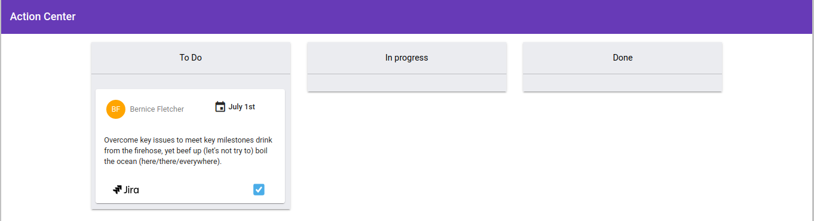
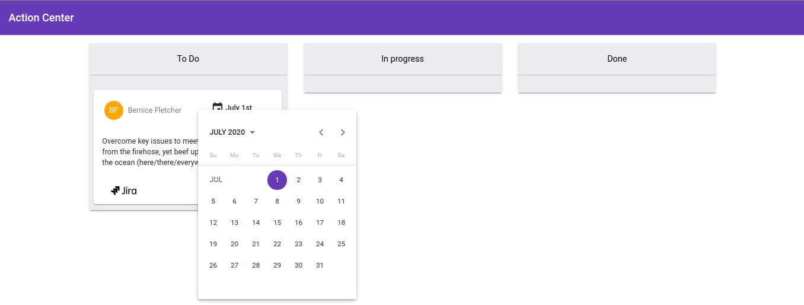

# ActionCenter
Action Center is a UI component build with Angular to help task management among team members.  

## Screenshots 




## Features 

* Allows action assignment to more than one person.
* Allows inline editing for action description.
* Internationalization (i18n) support. 
* Respects material design specs.


## Future work 
* Add Multiple theming support.
* Isolate ActionItemComponent in a standalone library project.
* Add more support for Jira, Slack and Trello (labels, emojis).
* Translate to other Languages.

## Running unit tests

In order to run unit tests you must have angular cli `11.0.0`, and you must have installed project dependencies using `npm install`. Navigate to the project directory in your Linux-Terminal and type the following commands :
```
$ chmod +x test.sh 
$ ./test.sh
```

## Deployment

The app doesn't require any additional steps other than the standard ones, just copy the content of `/dist/ActionCenter` folder 
into your Apache web server directory `/www` or one of its children and navigate to corresponding URL.   

## Development

This project was generated with [Angular CLI](https://github.com/angular/angular-cli) version 10.1.7.

### Development server

Run `ng serve` for a dev server. Navigate to `http://localhost:4200/`. The app will automatically reload if you change any of the source files.

### Code scaffolding

Run `ng generate component component-name` to generate a new component. You can also use `ng generate directive|pipe|service|class|guard|interface|enum|module`.

### Build

Run `ng build` to build the project. The build artifacts will be stored in the `dist/` directory. Use the `--prod` flag for a production build.

### Internationalization (i18n)

Internationalization file `messages.xlf` is generated but not translated yet, please refer to Angular docs [Internationalization guide](https://angular.io/guide/i18n) to see how this is achieved.
